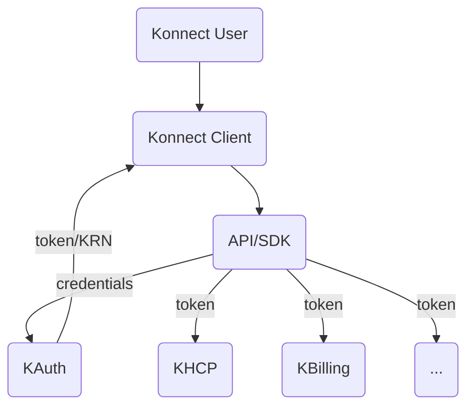

# Data fow diagrams

```mermaid
graph TD
    A(Konnect User) -->B(Konnect Client)
    B -->C(API/SDK)
    C --> |credentials| D(KAuth)
    D -->|token/KRN| B
    C --> |token| E(KHCP)
    C --> |token| F(KBilling)
    C --> |token| G(...)
```
