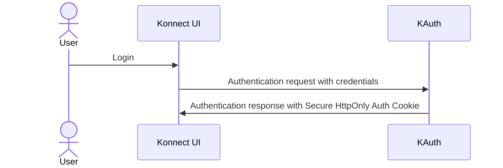
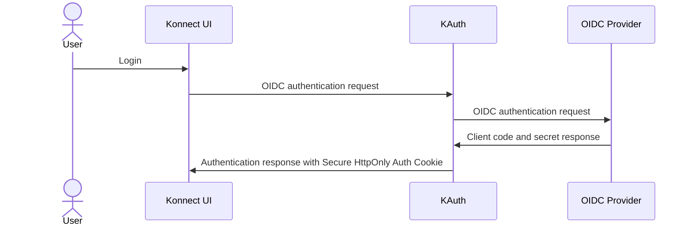
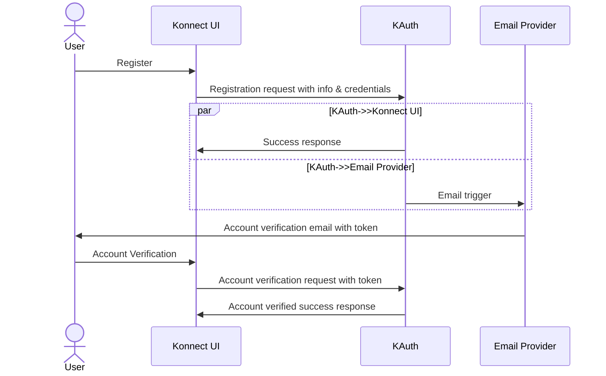
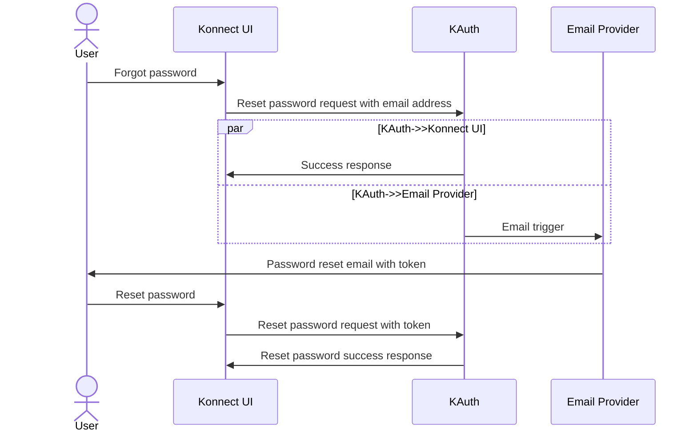

# Sequence diagrams

## User login flow (basic auth)

```mermaid
sequenceDiagram
  actor User
  participant Konnect UI
  participant KAuth
  User->>Konnect UI: Login
  Konnect UI->>KAuth: Authentication request with credentials
  KAuth->>Konnect UI: Authentication response with Secure HttpOnly Auth Cookie
```

## User login flow (SSO)

```mermaid
sequenceDiagram
  actor User
  participant Konnect UI
  participant KAuth
  participant OIDC Provider
  User->>Konnect UI: Login
  Konnect UI->>KAuth: OIDC authentication request
  KAuth->>OIDC Provider: OIDC authentication request
  OIDC Provider->>KAuth: Client code and secret response
  KAuth->>Konnect UI: Authentication response with Secure HttpOnly Auth Cookie
```

## User registration flow

```mermaid
sequenceDiagram
  actor User
  participant Konnect UI
  participant KAuth
  participant Email Provider
  User->>Konnect UI: Register
  Konnect UI->>KAuth: Registration request with info & credentials
  par KAuth->>Konnect UI
    KAuth->>Konnect UI: Success response
  and KAuth->>Email Provider
    KAuth->>Email Provider: Email trigger
  end
  Email Provider->>User: Account verification email with token
  User->>Konnect UI: Account Verification
  Konnect UI->>KAuth: Account verification request with token
  KAuth->>Konnect UI: Account verified success response
```

## Forgot password flow

```mermaid
sequenceDiagram
  actor User
  participant Konnect UI
  participant KAuth
  participant Email Provider
  User->>Konnect UI: Forgot password
  Konnect UI->>KAuth: Reset password request with email address
  par KAuth->>Konnect UI
    KAuth->>Konnect UI: Success response
  and KAuth->>Email Provider
    KAuth->>Email Provider: Email trigger
  end
  Email Provider->>User: Password reset email with token
  User->>Konnect UI: Reset password
  Konnect UI->>KAuth: Reset password request with token
  KAuth->>Konnect UI: Reset password success response
```
